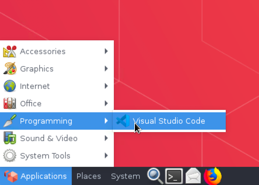
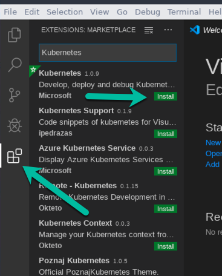
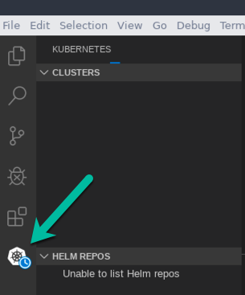
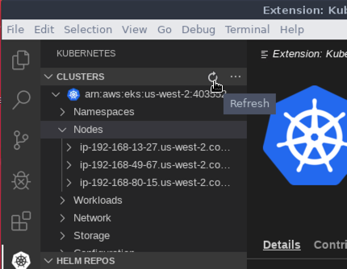

# Intro to Kubernetes <!-- omit in toc -->

- [Some Helpful Links](#some-helpful-links)
- [Verifying Your AWS Workspace Setup](#verifying-your-aws-workspace-setup)
  - [Open VS Code](#open-vs-code)
  - [Install VS Code Kubernetes Extension](#install-vs-code-kubernetes-extension)
  - [Setup AWS Credentials](#setup-aws-credentials)
  - [Verify Kubernetes Connectivity](#verify-kubernetes-connectivity)
- [What is Kubernetes?](#what-is-kubernetes)
  - [An Operating System for the Cloud](#an-operating-system-for-the-cloud)
  - [Kubernetes is winning the race](#kubernetes-is-winning-the-race)
  - [Desired State Management](#desired-state-management)
  - [Kubernetes Engines](#kubernetes-engines)
- [Working with Kubernetes (kubectl)](#working-with-kubernetes-kubectl)
  - [Common kubectl commands](#common-kubectl-commands)
  - [Namespaces](#namespaces)
  - [Speaking Kuberentes Language](#speaking-kuberentes-language)

# Some Helpful Links
[This might be the most important thing of all!](https://www.youtube.com/watch?v=uMA7qqXIXBk)

Please read through this article prior to the workshop: https://www.weave.works/technologies/the-journey-to-kubernetes/

# Verifying Your AWS Workspace Setup
Please perform the following steps to ensure your AWS workspace is ready
for the workshop.  If any of these steps do not work for you please contact
the instructor prior to the workshop.

## Open VS Code
To open VS Code to **Applications** -> **Programming** -> **Visual Studio Code**.



## Install VS Code Kubernetes Extension
After opening VS Code you will need to install the Kubernetes extension.  
To do this, open the **Extensions** window and search for Kubernetes.  Then
click **install**.



After the extension is installed you will see it on the left hand toolbar.




## Setup AWS Credentials
We will be connecting to an [EKS](https://aws.amazon.com/eks/) cluster for
workshop.  The credential for connecting have already been setup for you,
but will require you to copy them to your user folders.  To setup the 
credentials open a **Terminal** in VS Code and run the following commands:

```
$ mkdir -p ~/.aws ~/.kube
$ /setup/run.sh
```

## Verify Kubernetes Connectivity
After setting up your credentials, open the **Kubernetes** extension in
VS Code and hit the **Refresh** button.  You should see the **tccodes**
cluster in the list.




# What is Kubernetes?

## An Operating System for the Cloud
Why do we need an operating system for the cloud?  And what does that mean? 
Condsider the old days of computers, when Microsoft was putting out an operating
system and hardware manufacturers were building CPUs, Memory, and Hard Drives so 
make the things work.  In order to allow developers to write software that worked
with any of the vendors hardware, they used a [Hardware Abstraction Layer (HAL)](https://en.wikipedia.org/wiki/HAL_(software))
which was part of the Operating System.  The operating system was taking on the 
responsibility of figuring out how to talk to the hardware for the developer.  

Fast forward a few years and you can see this same technique used by virtualization
systems such as Hyper-V and VMWare.  All they had to do was build a virtual layer that
spoke to the operating system the same way the hardware did, and then swap it out. Once
you did that, the operating system had no idea it was running in a virtual environment,
and it really didn't care.

Pre-dating the rise of virtualization was the need for high-availaiblity.  Applications were
becoming more critical to businesses, and they needed a way to ensure the continual 
delivery of the application without inturuption.  This head to clustering techniques and 
technologies.  Simply put, one server was not enough, because it was a single point of 
failure, so the answer was to have multiple servers fulfilling the same role.  This
was often in the form of replication.  These topics are beyond the scope of this course, 
but just remember it took multiple redundant servers to fulfill this need.

Managing clusters of servers was very difficult.  There were many problems that needed to be
solved.  For example, if I have three web servers running, how do I make sure users are always
hitting one that is healthy (i.e. load balancing).  Another problem is service discovery,
if SQL is running on multiple servers, how do I know what one to talk to?

With the rise of [DevOps], the lines between developers and IT were blurred, and the need 
for a new type of operating system arose, a **cloud operating system**.  Looking back to 
the Microsoft example,  the role of the operating system was to allow the developer to work
with things like CPU, Memory, and Disk without having to know the low level details of how
to manage them.  A **cloud operating system** does this, but also adds in abstractions around
networking, service discovery, and load balancing.  This is precesiely why Mesos created [DCOS]
which is an alternative to Kubernetes.

## Kubernetes is winning the race
For the past few years their have been a few technologies trying to solve this problem, such as [DCOS], [Kubernetes],
and [docker-swarm].  The diagram below is from the Weave article I linked at the top of this page. 
It leads us to believe Kubernetes is winning this race by a long shot.


## Desired State Management
In order to understand how [Kubernetes] works you have to understand **Desired State Management** (DSM). DSM
is the process where we describe how we want our system to look, then a system (like Kubernetes) is responsible
for making sure the system actually looks like that.  We are separate the **What** we want from the **How** it 
is going to be fulfilled.  Our responsibility is to define the **What** and [Kubernetes] responsibiilty is to 
provide the **How** and to always make sure our **actual state** matches our **desired state**.

The diagram below shows how this works.  The **Developer** defines the **desired state** using [Kubernetes] language,
and [Kubernetes] is responsible for making sure the **actual state** matches it.  Initially the **actual state** won't
have anything in it, so [Kubernetes] will start creating the resources to satisify it.  For example, we need a load balancer,
so [Kubernetes] will make sure we have one and that it is running.  Notice I didn't say [Kubernetes] would **create** one
and make sure it is running.  This brings up the idea of a [Kuberentes] engine, which I discuss below.

<p align="center">

</p>

## Kubernetes Engines
[Kuberentes] does not know how to create any of the hardware components that it uses to satisfy the needs 
of the developer.  This is what makes it so powerful.  Just like Microsoft put a hardware abstraction layer
inbetween the developer and the hardware manufacture, [Kubernetes] but a hardware abstraction layer inbetween
the developer and the cluster provider.  All [Kubernetes] does is definet he contract of how to **describe** 
what you want it to do, so it can relay that to the [Kubernetes] engine.  All major cloud vendors have fully
supported Kubernetes engines.  Here is a list of some of them:

  - [Amazon EKS](https://aws.amazon.com/eks/)
  - [Azure AKS](https://azure.microsoft.com/en-us/services/kubernetes-service/)
  - [Google Cloud GKE](https://cloud.google.com/kubernetes-engine/)
  - [Oracle OKE](https://docs.cloud.oracle.com/iaas/Content/ContEng/Concepts/contengoverview.htm)

When [Kubernetes] needs to create a load balancer, it will delegate that to the engine.  In AWS you will get an 
**Elastic Load Balance**, in Azure you will get an **Azure Load Balancer** etc...  This is true for all hardware
items, such as persistent disks, CPU's, Memory, and networking.  


# Working with Kubernetes (kubectl)
[Kubernetes] is 100% RESTful API-based, however they provide a command line tool called [kubectl](https://kubernetes.io/docs/reference/kubectl/overview/)
which is used for all management tasks.  The [Kubernetes] extension that is loaded in **VS Code** uses 
this command line tool under the hood.

**kubectl** is configured using a local file you will find on your workspace. Let's open the file and take a look at 
how it works.  The file is located at `~/.kube/config`.

## Common kubectl commands
For most of the session we will use the VS Code extension for interacting with [Kubernetes] but I wanted to show a couple
of common `kubectl` commands.

Gets a list of nodes in the cluster
```
$ kubectl get nodes
```

Gets a list of pods
```
$ kubectl get pods
```


## Namespaces
[Kubernetes] provides a concept of namespaces, which allows users to isolate resources from each other.  A namespace is 
a container of resources that belong together.  It can also be used to provided isolated development areas on the same 
cluster.

<p align="center">
    
</p>

## Speaking Kuberentes Language
[Kubernetes] is based on API's works with **Resource Defitions** which are stored internally as JSON objects. However,
the main format of working with **Resource Definition** files is **yaml**.

demo-web-pod.yaml
```
apiVersion: v1
kind: Pod
metadata:
  name: demo-web
  labels:
    app: demo-service
spec:
  containers:
  - name: nginx
    image: nginx
    ports:
    - containerPort: 80
      nane: TCP
    volumeMounts:
    - name: workdir
      mountPath: /usr/share/nginx/html
  volumes:
  - name: workdir
    emptyDir: {}
```

Here is an example of a simple service (which will default as a load balancer)

demo-service.yaml
```
apiVersion: v1
kind: Service
metadata:
  name: demo-service
spec:
  selector:
    app: demo-web
  ports:
    - protocol: TCP
      port: 80
      targetPort: 9376
```

Configuration is also stored as a resource definition.  Here is an example logging
config.

```
apiVersion: v1
data:
  config.yml: |
    logging:
      level: INFO
kind: ConfigMap
metadata:
  name: logging-config
```

[DevOps]: https://en.wikipedia.org/wiki/DevOps
[DCOS]: https://dcos.io/
[docker-swarm]: https://github.com/docker/swarm
[Kubernetes]: https://kubernetes.io/
